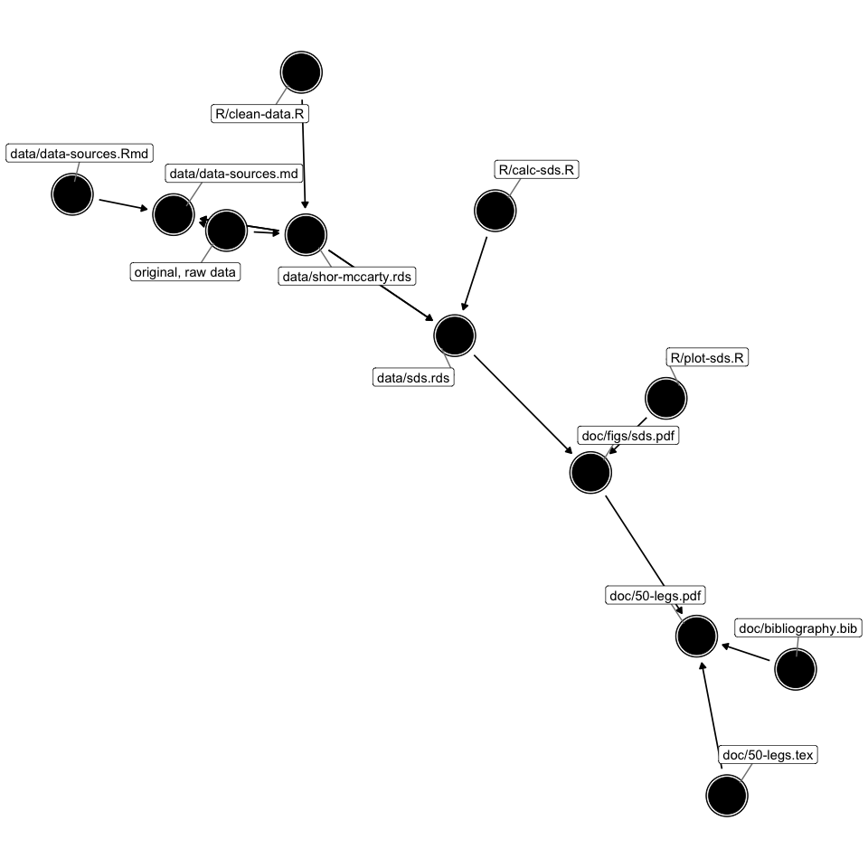

Project Overview
================

This project illustrates what I call a “project workflow.” I use
different types of plain-text files (`.R`, `.csv`, and `.tex`), which I
carefully document and deliberately develop, to connect the final
manuscript to the original, raw data.

To produce the final manuscript from the original, raw data, I do the
following:

  - **(1) preserve** the raw data in its original form,
  - **(2) tidy**, **(3) plot**, and **(4) model** the data with R, and
  - **(5) combine** text, figures, and tables with LaTeX.

These five steps are no-brainers, for the most part.

This strategy requires writing and maintaining several `.R` scripts and
`.tex` files that output many different `.csv`, `.rds`, and `.pdf` files
(and perhaps others). This presents dozens or hundreds of opportunities
to make a mistake that would be nearly impossible to discover.

To reduce the propensity for mistakes, we want to **document** the code
and **track** the changes in a manner that allows us to demonstrate to
ourselves and others how we obtained the result.

Suppose you have a project, and you’d like to push it forward. For an
example, let’s say you want to add a scatterplot.

1.  Make a small change–add the scatterplot. You have to write the code
    to create the scatterplot, insert the scatterplot into the document,
    and add the surrounding text and caption.
2.  Document the code that isn’t immediately self-explanatory.
3.  Verify that the new code doesn’t break any old code and vice versa.
    Make sure you can still rebuild the project from the raw data.
4.  Write a note to yourself about how and why you made this change.
    Backup the project and repeat.

<!-- end list -->

  - We want to **document** the dependence among the project files with
    a Makefile. This allows us to subset the project into multiple files
    and file types without introducing human-guided, repetitious
    actions. Curating a `Makefile` requires patience and attention. This
    is a feature, not a bug.
  - We want to **track** the project development using version control
    with git and GitHub so that we can record changes and return to an
    earlier version if needed. Carefully tracking changes with git takes
    time and effort. This is a feature, not a bug. Take a moment to
    browse the 20 or so files I created for this simple project.

To give you some sense of how complex a project can become, the DAG
below shows the dependencies among the files for this simple project.
You can see how quickly you might be overwhelmed. When you begin to lose
track of what scripts do and how they work together, you open yourself
up for mistakes. By following a thoughtful project workflow, we can
minimize the risk.

<!-- -->
